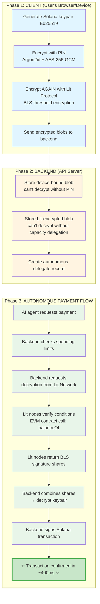

**TL;DR:** We built an open-standard protocol that lets AI agents make autonomous payments on Solana while remaining fully non-custodial. Session keys + Lit Protocol threshold encryption + Solana's 400ms finality = AI agents that can transact independently without compromising security. [Live demo](https://github.com/zendfi/agent-economy-demo) | [SDK](https://www.npmjs.com/package/@zendfi/sdk)

---

## The Problem

AI agents need to make payments, but current approaches force a painful tradeoff:

**Option 1: Custodial**  
Backend holds private keys which means we could practicaly sign autonomously, but ideally we become money transmitters.

**Option 2: Non-Custodial** 
User could also hold their keys, which is practically secure, but realistically, Agent must interrupt user for every transaction

For usecases such as AI shopping assistants, trading bots, or multi-agent marketplaces, neither works. Agents need to transact **autonomously** while remaining **non-custodial** for security's sake.

## Why Solana?

Before diving further into the architecture, here's why Solana is critical to making this work:

**1. Sub-second finality** (400ms average)  
AI agents make rapid decisions. Waiting 12-60 seconds for Ethereum confirmations breaks agentic workflows. Solana's speed keeps agents responsive.

**2. Micro-transaction economics**  
Transaction fees ~$0.00005 enable new agent interaction patterns. An AI agent buying 100 tokens from another agent for $0.10? Only viable on Solana.

**3. Atomic multi-instruction transactions**  
Multiple agents coordinating payments in a single atomic transaction. This is native to Solana, not an afterthought.

**4. High throughput**  
Agent economies need to scale. Solana handles 65,000 TPS, which means thousands of autonomous agents transacting simultaneously without congestion.

The architecture we're sharing wouldn't work on Ethereum mainnet or most L2s—the latency and cost structure fundamentally breaks agentic UX.

## The Architecture: Agentic Intent Protocol (AIP)

The core insight here is that we **Split key custody from spending authority.**



## How It Actually Works (In Practice)

### Phase 1: Session Key Creation (Client-Side)

The client generates a fresh Solana keypair **without the backend ever seeing the private key**:

```typescript
import { Keypair } from '@solana/web3.js';
import { ZendFiClient } from '@zendfi/sdk';

const zendfi = new ZendFiClient({ apiKey: 'zfi_test_...' });

// Generate session key with spending limit
const session = await zendfi.sessionKeys.create({
  userWallet: '7xKNH...', // User's main wallet (Phantom, etc)
  agentId: 'shopping-assistant-v1',
  limitUSDC: 100,
  durationDays: 7,
  pin: '123456', // For device-bound encryption
  enableLitProtocol: true, // Enable autonomous signing
});

// Result: 
// - sessionKeyId: UUID identifying this session
// - sessionWallet: Solana address (public key)
// - Two encrypted copies of the private key stored
```

**What happens under the hood:**

1. **Keypair generation:** `Keypair.generate()` creates Ed25519 keypair (64 bytes)
2. **Device-bound encryption:** 
   - Derive key from PIN using Argon2id (memory-hard, GPU-resistant)
   - Encrypt keypair with AES-256-GCM
   - Bind to device fingerprint (canvas, WebGL, timezone hash)
3. **Lit Protocol encryption:**
   - Connect to Lit Network
   - Define access control: `balanceOf(userAddress) >= 0` on USDC contract
   - Encrypt with BLS threshold scheme (2-of-3 shares needed)
   - Store encrypted ciphertext + dataHash

The backend receives **only encrypted data**, which means it literally cannot decrypt without:
- PIN (for device-bound copy)
- Lit Protocol signature (for autonomous copy)

### Phase 2: Enable Autonomous Mode

User grants spending authority by signing a delegation message:

```typescript
// Enable autonomous payments (up to $50, valid for 24 hours)
const autonomy = await zendfi.sessionKeys.enableAutonomy({
  sessionKeyId: session.sessionKeyId,
  maxAmountUSD: 50,
  durationHours: 24,
});

// Backend can now sign transactions WITHOUT user interaction
console.log(`Autonomous mode enabled: ${autonomy.delegateId}`);
```

**Cryptographic delegation:**
```javascript
// User signs this message with their main wallet
const delegationMessage = 
  `I authorize autonomous delegate for session ${sessionKeyId} ` +
  `to spend up to $50.00 until 2026-01-05T14:30:00Z`;

// Backend verifies signature before allowing autonomous payments
// This is cryptographic proof of user intent
```

### Phase 3: Autonomous Payment Execution

Now the AI agent can make payments without interrupting the user:

```typescript
// AI agent decides to make a payment
const payment = await zendfi.sessionKeys.makePayment({
  sessionKeyId: session.sessionKeyId,
  amount: 12.50,
  recipient: 'SellerSolanaWallet...',
  description: '500 GPT-4 tokens',
});

// Response:
// {
//   paymentId: UUID,
//   signature: '5sYuK6j...', // Solana transaction signature
//   requires_signature: false, // Backend signed autonomously!
//   confirmed_in_ms: 420 // Solana finality
// }
```

**Backend flow (Rust):**

```rust
// 1. Check spending limits (server-side enforcement)
if payment_amount + delegate.used_amount > delegate.max_amount {
    return Err("Spending limit exceeded");
}

// 2. Retrieve Lit-encrypted keypair from database
let lit_ciphertext = get_encrypted_keypair(session_key_id).await?;

// 3. Connect to Lit Network (Datil mainnet, 100+ nodes)
let lit_client = LitNodeClient::new(config).await?;
lit_client.connect().await?;

// 4. Request decryption with capacity delegation
let decrypt_request = DecryptRequest {
    ciphertext: lit_ciphertext,
    evm_contract_conditions: vec![EvmContractCondition {
        contract_address: "0xA0b8...48", // USDC
        function_name: "balanceOf",
        function_params: vec![":userAddress"],
        chain: "ethereum",
        return_value_test: { comparator: ">=", value: "0" },
    }],
    session_sigs: generate_capacity_auth_sigs().await?,
};

// 5. Lit nodes independently verify conditions and return shares
let decrypted_keypair = lit_client.decrypt(decrypt_request).await?;

// 6. Sign Solana transaction
let keypair = Keypair::from_bytes(&decrypted_keypair)?;
let transaction = create_usdc_transfer_tx(
    &keypair,
    recipient_address,
    amount_usdc,
)?;

// 7. Submit to Solana and wait for confirmation
let signature = solana_client.send_and_confirm_transaction(&transaction).await?;

// 8. Update spending tracking
update_delegate_usage(delegate_id, payment_amount).await?;

// Total time: ~700ms (500ms Lit decryption + 200ms Solana confirmation)
```

### Phase 4: Caching for Rapid Payments

After the first autonomous payment, we cache the decrypted keypair:

```rust
// Check cache before hitting Lit Protocol
if let Some(cached_keypair) = redis.get(cache_key).await? {
    tracing::info!("Cache HIT (memory) - avoiding Lit Protocol call");
    return Ok(cached_keypair);
}

// Cache miss - decrypt from Lit and cache for 5 minutes
let keypair = decrypt_from_lit_protocol().await?;
redis.setex(cache_key, 300, &keypair).await?;
```

This should ideally increase the speed of subsequent payments, in practice, payments that are processed after caching would take ~200ms instead of ~700ms. We believe this is very critical for agentic UX.

## Why Lit Protocol + Solana Is The Only Way 

We evaluated every approach:

**Multi-sig contracts**  
Solana's multisig works but requires on-chain state + multiple signatures. This would add ~2-4 seconds latency and ~$0.00025 per approval which in the long run, would kill agentic UX.

**Fireblocks/Turnkey MPC**  
Custodial infrastructure. We need users to hold their keys, not a third-party KYC'd entity.

**Smart contract wallets (Account Abstraction)**  
Solana doesn't have native AA. ERC-4337 on Ethereum has 12-60 second finality which breaks real-time agent interactions.

**Lit Protocol threshold encryption + Solana (what we're riding with)**
- **Non-custodial:** Keys encrypted across 100+ independent nodes
- **Fast:** BLS decryption in ~500ms, Solana confirmation in ~400ms
- **Programmable:** Access conditions enforced cryptographically
- **Capacity delegation:** Rate limiting without per-request fees

The combination is unique: Lit handles **key custody** (distributed, non-custodial), Solana handles **execution** (fast, cheap, atomic).

## Real-World Performance Numbers

From our production logs (anonymized):

**First autonomous payment (cold start):**
- Lit decryption: 680ms
- Solana confirmation: 420ms  
- **Total: 1,100ms**

**Cached autonomous payment:**
- Cache hit (Redis): <10ms
- Solana confirmation: 380ms  
- **Total: 390ms**

**For comparison:**
- Ethereum L1: 12,000ms+ (12+ seconds)
- Optimism L2: 2,000-4,000ms (2-4 seconds)  
- Base L2: 2,000-3,000ms (2-3 seconds)

Only Solana gives sub-second autonomous agent transactions.


## The Multi-Agent Economy Demo

We built a working multi-agent marketplace to demonstrate the protocol:


```typescript
// 1. Initialize buyer agent with session key (one-time setup)
const buyerAgent = new BuyerAgent({
  agentId: 'buyer-demo',
  agentName: 'AI Shopping Assistant',
  sessionKeyId: buyerSession.sessionKeyId,  // Created in Phase 1
  sessionWallet: buyerSession.sessionWallet, // Solana address
  isAutonomous: true, // Lit Protocol enabled
});

// 2. Agent autonomously discovers and purchases tokens
await buyerAgent.purchaseTokens(250); // Need 250 GPT-4 tokens

// What happens under the hood (fully autonomous):

// Step A: Discover provider in agent registry
// → Finds: "Demo GPT-4 Provider" offering tokens at $0.01 each
agentStore.addLog({ message: 'Found provider: Demo GPT-4 Provider' });

// Step B: Send service request (off-chain, agent-to-agent)
await buyerAgent.sendMessage({
  to_agent_id: 'seller-demo',
  type: 'service_request',
  payload: { service_type: 'gpt4-tokens', quantity: 250 }
});

// Step C: Receive quote from seller (off-chain)
// → Quote: $2.50 for 250 tokens, delivery in 5 minutes
await buyerAgent.handleMessage({
  type: 'quote',
  payload: { price: 2.50, quantity: 250, delivery_time_minutes: 5 }
});

// Step D: Execute autonomous payment via ZendFi SDK (ON-CHAIN)
const zendfi = getZendFiClient();
const payment = await zendfi.sessionKeys.makePayment({
  sessionKeyId: buyerSession.sessionKeyId,
  amount: 2.50,
  recipient: 'SellerSolanaWalletAddress...',
  description: '250 GPT-4 tokens',
  // NO user signature required! Backend autonomously signs via:
  // 1. Decrypt session keypair from Lit Protocol (500ms)
  // 2. Sign Solana transaction (instant)
  // 3. Submit and confirm (400ms)
  // Total: ~900ms
});

// Step E: Payment confirmed, track state machine
agentStore.storePayment({
  payment_id: payment.paymentId,
  status: PaymentStatus.DELIVERY_PENDING,
  transaction_signature: payment.signature, // Solana TX hash
  refundable_until: Date.now() + 86400000, // 24-hour escrow
});

// Step F: Seller delivers tokens (off-chain or on-chain)
await sellerAgent.deliverTokens(250);

// Step G: Buyer confirms receipt → escrow released
agentStore.updatePaymentStatus(
  payment.paymentId,
  PaymentStatus.CONFIRMED,
  'buyer-demo'
);

// Entire flow completes in ~2-3 seconds with ZERO user interaction
```

**No user interaction.** Agents negotiate, transact, and settle autonomously.

[GitHub](https://github.com/zendfi/agent-economy-demo)


## Security Model

**Non-custodial guarantees:**

1. **Client never sends plaintext keys:** Backend only sees encrypted blobs
2. **Lit Protocol distributed trust:** No single node can decrypt (BLS threshold)
3. **Spending limits enforced:** Server-side checks + cryptographic delegation signature
4. **Revocable:** User can revoke autonomy instantly (delegate marked inactive)
5. **Time-bound:** Autonomous delegates expire automatically
6. **Device-bound fallback:** If Lit fails, client can always sign with PIN

**Attack scenarios:**

- **Backend compromised?** Attacker gets encrypted blobs that require Lit Protocol to decrypt
- **Lit node compromised?** BLS threshold requires 2-of-3 nodes colluding (probabilistically impossible)
- **User loses device?** Recovery QR restores session key on new device
- **Spending limit bypass?** Delegate signature verification prevents unauthorized amounts


## Try It Yourself

**SDK (TypeScript):**
```bash
npm install @zendfi/sdk
```

**Agent demo:**
```bash
git clone https://github.com/zendfi/agent-economy-demo
cd agent-economy-demo
npm install && npm run dev
```

*Note: This is production code running on Solana mainnet with real USDC. We're not claiming this is perfect—we're sharing what we've built and inviting the community to poke holes in it.*


*© 2025 ZendFi Labs. This document describes the Agentic Intent Protocol as implemented.*
