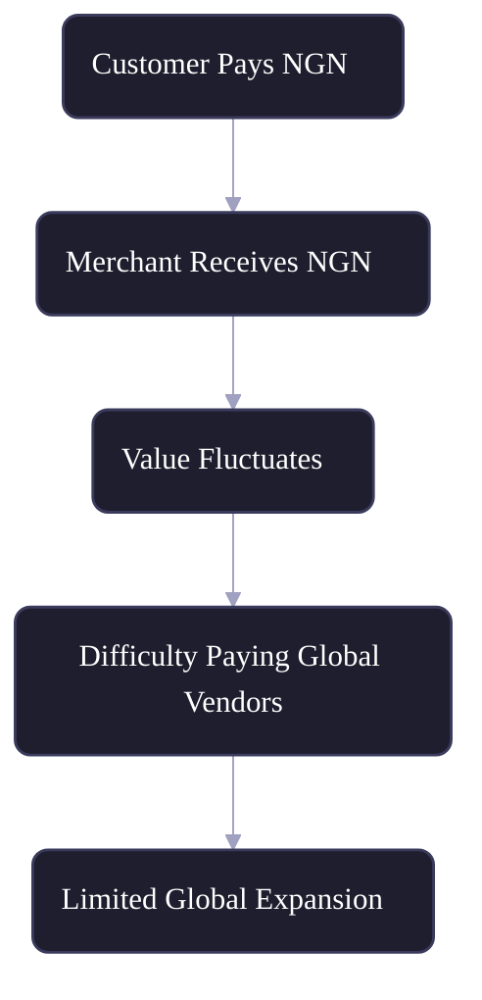
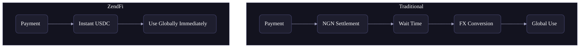
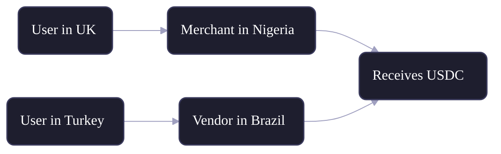
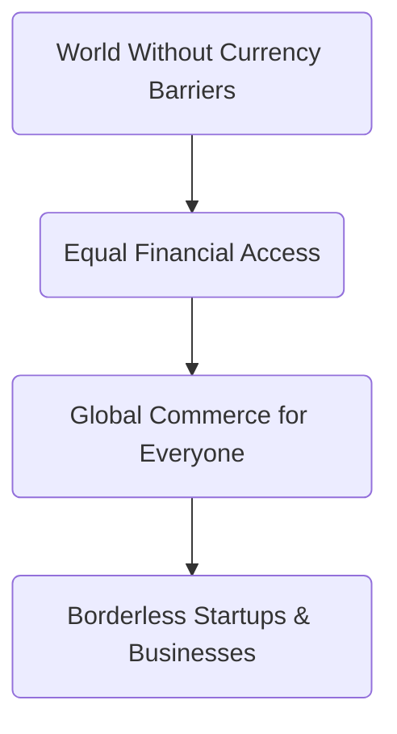

For years, African startups have had to make a painful trade-off.

You could build locally serve your community, support local financial systems, price in naira, cedis, or shillings and accept that your revenue would stay trapped in a currency that loses value faster than you can reinvest it. Or you could try to go global, wrestle with the paperwork of foreign bank accounts, absorb the punishing fees of international wire transfers, and still find yourself locked out of platforms that simply don't support your country.

**That trade-off shouldn't exist.**

The problem has never been that African builders lack ambition or talent. It's that the financial infrastructure surrounding them was never designed with them in mind. Legacy banking rails, correspondent bank fees, and volatile local currencies have quietly taxed African businesses for decades not through malice, but through neglect.

At **ZendFi**, we're building a world where geography is no longer a financial handicap. Where a founder in Lagos has the same financial agility as one in London. Where accepting a payment from a customer in Abuja can instantly translate into the ability to pay a supplier in Berlin.

This is the story of how we're doing it and why it matters more than ever.

---

## The Problem Isn't Payments, It's What Comes After

Ask most fintech observers about Africa's payments landscape and they'll tell you it's booming and they'd be right. Mobile money has reached hundreds of millions of people. Payment gateways have proliferated. QR codes and USSD have brought digital commerce to the unbanked. Accepting payments locally, in 2026, is genuinely no longer the hard part.

The real bottleneck starts **the moment that payment settles**.

Imagine you run a growing SaaS company based in Nigeria. A customer pays you ₦150,000 for a subscription. That money lands in your naira account. Now what? You need to renew your AWS infrastructure bill priced in dollars. You want to pay a freelance designer in Kenya. You're exploring a partnership with a vendor in Portugal. Suddenly, the naira in your account becomes a liability. You're watching it depreciate in real time, scrambling to convert it before it loses even more value, paying conversion spreads that eat into your margins, and waiting days sometimes longer for international transfers to clear.

This isn't a niche problem. It's the daily reality for tens of thousands of African businesses operating in the digital economy.

### What the current payment journey actually looks like:

Every step in this chain is a leak. The longer the money sits in local currency, the more purchasing power bleeds away. The more conversions required, the more fees accumulate. By the time a business is ready to reinvest its revenue into global operations, a meaningful percentage of it has simply evaporated.

### The structural challenges at a glance:

| Challenge           | Impact                                                        |
| ------------------- | ------------------------------------------------------------- |
| Currency volatility | Revenue value is unpredictable from week to week              |
| Local settlement    | Funds are locked in a currency with limited global utility    |
| FX barriers         | Every conversion carries spread costs and bank fees           |
| Delayed settlements | Multi-day clearing windows slow down operations and decisions |

The compounding effect of these challenges is brutal for early-stage companies especially. When you're running lean, every percentage point of value lost to FX friction is runway you didn't get to use.

---

## A Different Approach to Payments

ZendFi was built on a simple but powerful premise: the checkout experience shouldn't have to change, but everything that happens behind it absolutely should.

Your customers are comfortable paying in their local currency. That familiarity drives conversion. Forcing them to think in dollars or deal with crypto wallets would create friction that costs you sales. So we don't ask them to change anything. They pay exactly as they always have.

What changes is what happens on the merchant side instantly and automatically.

> **What if local payments could unlock global financial power the moment they're made?**

ZendFi's processing layer sits between the local payment and the merchant's wallet. When a customer pays in naira, cedis, or any supported local currency, ZendFi handles the conversion and settlement in USDC a dollar-pegged stablecoin before the transaction is even complete from the merchant's perspective. There's no waiting, no manual conversion, no FX desk to call.

### How it works under the hood:

The elegance here is in the asymmetry. The customer sees nothing new. But the merchant walks away with dollar-stable value they can immediately deploy paying global vendors, holding in a stable store of value, or off-ramping to local currency whenever it makes sense on their own terms.

**The key insight:**

- Customer experience → **completely unchanged**
- Merchant experience → **fundamentally upgraded**

This is how infrastructure should work. Invisible to the end user. Transformative to the business.

---

## What Actually Changes for Your Business?

To really understand the impact, it helps to trace a single payment through both the old world and the new one side by side.

In the traditional model, a payment received today might not be fully settled for one to three business days. Then it sits in a naira account, losing value in real time. When the merchant finally needs to use it globally, they queue a transfer, pay a conversion spread, absorb a bank fee, and wait again. By the time the money reaches its destination, it may have lost 10–20% or more of its original value not in a single dramatic event, but in a slow, invisible drain across several steps.

With ZendFi, that entire chain collapses into a single moment.

### Traditional Flow vs. ZendFi:

The difference isn't just convenience it's a structural shift in how a business relates to its own revenue. When your money is stable and immediately accessible, you can make faster decisions, pay vendors without anxiety, plan your cash flow with confidence, and grow without constantly fighting your own payment infrastructure.

---

## Why Currency Stability Is a Business Strategy, Not Just a Finance Topic

Currency instability isn't just annoying it's a **structural disadvantage** that distorts every part of a business built on top of it.

Consider pricing. If you're a SaaS company earning in naira but your cloud costs are in dollars, you're essentially forced to price your product based on a moving target. Raise prices too often and you lose customers. Don't raise them enough and your margins erode. This isn't a pricing strategy problem it's a currency exposure problem dressed up as one.

Consider hiring. Talented developers and designers increasingly expect to be compensated in dollar-equivalent terms. If your revenue is in naira and your cost base is in dollars, you're caught in a permanent squeeze that stifles your ability to attract the team you need.

Consider fundraising. Investors looking at African startups frequently discount valuations to account for currency risk. Demonstrating that your revenue is settled in USDC removes a layer of that risk from the table entirely.

### The real-world impact comparison:

| Factor               | Local Currency Settlement  | USDC Settlement           |
| -------------------- | -------------------------- | ------------------------- |
| Value retention      | ❌ Erodes over time         | ✅ Stable by design        |
| Global payments      | ❌ Multi-step, expensive    | ✅ Immediate, seamless     |
| Financial planning   | ❌ Unpredictable baseline   | ✅ Consistent unit of account |
| Fundraising optics   | ❌ Currency risk discount   | ✅ Reduced FX exposure     |
| Team compensation    | ❌ Naira vs. dollar gap     | ✅ Pay in stable value     |
| Growth potential     | ❌ Geographically limited   | ✅ Globally scalable       |

Settling in USDC isn't just a payment preference. It's a way of de-risking your entire business model.

---

## Powering Truly Global Commerce

Now zoom out beyond the individual business and look at what becomes possible at scale.

One of the persistent myths about African commerce is that it is primarily local. But the reality is that African businesses have always been deeply connected to global supply chains, global talent, and global markets. The friction wasn't a reflection of intent it was a reflection of infrastructure. Merchants in Lagos source products from China. Developers in Nairobi serve clients in the US and Europe. Agencies in Accra run campaigns for brands across three continents.

The money has always wanted to move. The rails just weren't built for it.

ZendFi changes that equation. When a business can receive a payment from a customer anywhere, settle it instantly into stable value, and deploy that value globally within minutes the geographic barriers that once defined market access simply dissolve.

### Cross-border payments without friction:

A merchant in Nigeria receives a payment from a user in the UK. A vendor in Brazil serves a client in Turkey. Both settle instantly in USDC. Neither has to think about correspondent banks, clearing windows, or exchange rate risk. The payment just works the same way it should have always worked.

No settlement delays. No banking barriers. No geographic limitations.

Just **value moving freely, the way the internet always promised commerce would.**

---

## The Shift in Thinking

Here's where we want to be direct: what ZendFi is building isn't just a payments product. It's a different mental model for how African businesses can relate to money.

The old model was defined by constraints. You earned locally because that's where your customers were. You struggled globally because that's where the friction was. The assumption, baked into the infrastructure and into the mindset, was that local and global were fundamentally in tension. That to thrive in one, you had to accept limitations in the other.

That assumption was never true. It was just the limit of what the infrastructure could support.

**Old model defined by where you are:**
- Earn in local currency
- Lose value to inflation and FX spreads
- Struggle to pay global vendors and talent
- Growth constrained by geography and financial access

**New model with ZendFi defined by where you're going:**
- Accept payments in any local currency
- Settle instantly in stable dollar value
- Pay anyone, anywhere, immediately
- Scale without your payment stack becoming a ceiling

This is a fundamentally different orientation. Instead of asking "how do I manage the cost of going global?", businesses using ZendFi can ask "where do I want to grow next?" and the infrastructure moves with them.

---

## Local Roots, Global Reach

We want to be clear about something: ZendFi is not a product built against local economies. We're not asking African businesses to abandon the naira, abandon their local customers, or pretend their context doesn't matter. Quite the opposite.

We believe the strongest businesses are the ones deeply embedded in their local markets because that's where the relationships are, where the trust is built, and where the real growth happens first. What ZendFi does is ensure that local success doesn't have to come at the cost of global capability.

When you build with ZendFi, you're not choosing between your roots and your reach. You're amplifying both.

### What you unlock from day one:

- **Global transactions:** receive and send payments across borders without the traditional overhead
- **Stable value storage:** hold your revenue in USDC, protected from local currency depreciation
- **Instant settlement:** no more waiting days for funds to clear before you can act on them
- **Seamless off-ramping:** convert back to local currency whenever you choose, on your schedule, at competitive rates
- **Cleaner financial reporting:** a stable unit of account makes accounting, planning, and investor reporting dramatically simpler
- **Access to global talent:** pay contractors and employees in stable value without friction or currency mismatch

Each of these capabilities compounds. A business that can hire globally, pay vendors instantly, plan with confidence, and hold stable revenue is a business that can compete not just locally, but on the world stage.

---

## The Bigger Vision

We want to close with the thing that actually drives us.

ZendFi is a payments infrastructure company. But payments are just the entry point. What we're really building toward is a world where the financial system stops being a gatekeeper where it stops deciding who gets to participate in global commerce based on the passport they hold or the currency of the country where they were born.

Today, a startup founder in San Francisco can accept a payment, hold it in a stable currency, wire it across borders, and reinvest it in their business all within minutes and at negligible cost. That same sequence of events, for a founder in Kano or Kumasi or Kampala, involves a week of delays, multiple middlemen, and fees that eat into margins that were already thin.

That gap is not inevitable. It's infrastructural. And infrastructure can be rebuilt.

### The future we're building toward:

Every business that plugs into ZendFi is a proof point that this future is possible. Every naira converted to USDC without friction, every cross-border payment that clears in seconds instead of days, every founder who doesn't have to think about FX risk when making a business decision these are the small, compounding moments that add up to structural change.

We're not naïve about how much work remains. Regulation is complex. Local banking relationships take time to build. Stablecoin infrastructure is still maturing in many markets. But the direction is clear, and the momentum is real.

---

## Final Thought

A startup's location should not determine its financial power. The quality of your ideas, the strength of your team, and the value you create for your customers those are the things that should define your ceiling.

ZendFi exists because we believe the infrastructure of money should expand what's possible, not limit it. Because the builders and entrepreneurs across Africa deserve financial rails that match their ambition. Because "local" and "global" were never really in conflict they just needed the right bridge.

> You build locally.
> You operate globally.
> You scale without limits.

That's not just a tagline. It's the future we're building one payment at a time.